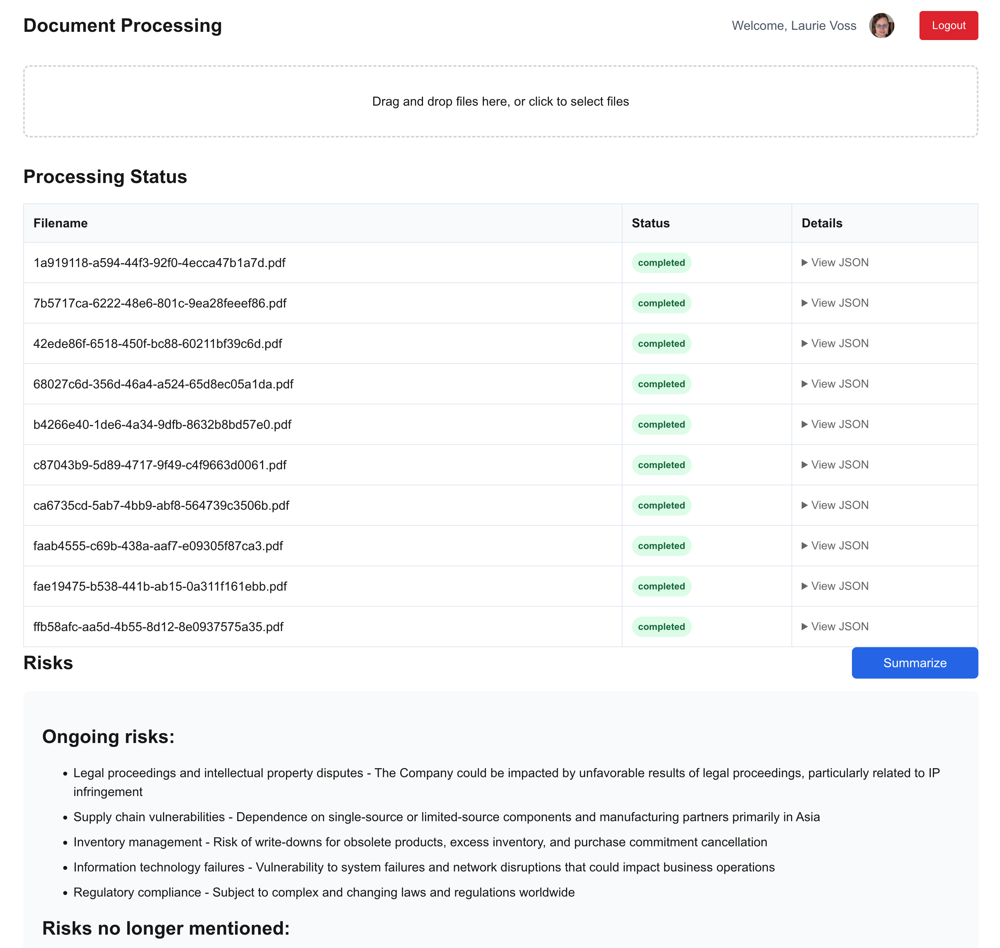

# 10K multi-year Risk Summarizer

This is a quick-and-dirty web app that summarizes how the risks identified by a corporation in its annual 10K filings have changed over time. It use [LlamaExtract](https://docs.cloud.llamaindex.ai/llamaextract/getting_started), part of [LlamaCloud](https://cloud.llamaindex.ai/), and of the course the LlamaIndex framework. It expects to work on 10K filings; you can find [Apple's 10K filings for many years](https://investor.apple.com/sec-filings/default.aspx) on their investor relations site.

We hope this gives you a useful jumping-off point for your own projects using LlamaExtract!



## Setup

You'll need a few values in your `.env.local` file to get this working:

* `NEXTAUTH_URL` which can be set to `http://localhost:3000` for testing
* `NEXTAUTH_SECRET` which can be any random string
* `GOOGLE_CLIENT_ID` and `GOOGLE_CLIENT_SECRET` which you can get from the [Google Cloud Console](https://console.cloud.google.com/apis/credentials) by creating a new OAuth client.
* `LLAMA_CLOUD_API_KEY` which you can get from the [LlamaCloud Console](https://cloud.llamaindex.ai/api-keys) for free.
* `LLAMA_EXTRACT_AGENT_ID` which you can get from the "Extraction" screen of your LlamaCloud project. You should use the UI to create your schema.
* `ANTHROPIC_API_KEY` which you can get from the [Anthropic Console](https://console.anthropic.com/settings/keys).

## Running

```bash
npm install
npm run dev
```

## Under the hood

The web app has only a handful of API routes:

* `/api/auth` for authentication (handled by NextAuth)
* `/api/process` accepts the uploaded file and kicks off the extraction job
* `/api/status` is a polling endpoint for the client to check on the status of the job
* `/api/result` fetches the results of the extraction once ready
* `/api/summarize` takes multiple years of risks and summarizes them, then returns the summary as HTML

## Resources

* [LlamaExtract docs](https://docs.cloud.llamaindex.ai/llamaextract/getting_started)
* [More LlamaExtract code examples](https://github.com/run-llama/llama_cloud_services/tree/main/examples/extract)
* [About LlamaCloud](https://www.llamaindex.ai/enterprise)
